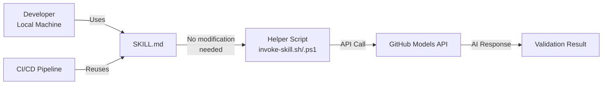

# Local-to-Pipeline Workflow

This document explains how teams can use SKILL.md files locally during development, then seamlessly integrate the **exact same files** into CI/CD pipelines as they scale.

## 🎯 The Pattern



## 📖 Story: Dockerfile Security at Scale

### Phase 1: Local Experimentation (Week 1)

**Developer Alice** wants to improve Dockerfile security. She discovers `dockerfile-hardener/SKILL.md`:

```bash
# Alice tries it locally with Copilot agent
@workspace /new Use catalog/dockerfile-hardener/SKILL.md to review my Dockerfile
```

The AI analyzes her Dockerfile and suggests security improvements. Alice is impressed!

### Phase 2: Team Adoption (Week 2-3)

Alice shares the skill with her team. They all start using it:

```bash
# Bob uses it
@workspace Review Dockerfile with dockerfile-hardener skill

# Carol uses it
@workspace Check my Dockerfile for vulnerabilities using dockerfile-hardener
```

The team notices they're finding issues **before** they reach production. They want to standardize this.

### Phase 3: Customization (Optional, Week 4)

The team decides to customize the skill for their environment:

```markdown
<!-- They add to dockerfile-hardener/SKILL.md -->

## Company-Specific Requirements
- All images must use internal registry: registry.company.com
- Alpine Linux required for base images (security policy)
- HEALTHCHECK instruction mandatory for all services
```

Everyone continues using the **same file** locally. No duplication.

### Phase 4: Pipeline Integration (Week 5)

As the team scales (10+ developers), manual reviews become a bottleneck. They want automation.

**Solution:** Use the **exact same SKILL.md** in their CI/CD pipeline:

```yaml
# .github/workflows/dockerfile-validation.yml
name: Dockerfile Security Gate

on: [pull_request]

jobs:
  validate:
    runs-on: ubuntu-latest
    steps:
      - uses: actions/checkout@v4
      
      - name: Security Gate
        run: |
          # SAME FILE they use locally!
          ./catalog/pipeline-skill-invoker/scripts/invoke-skill.sh \
            --skill catalog/dockerfile-hardener/SKILL.md \
            --task "Review this Dockerfile: $(cat services/api/Dockerfile)" \
            --output validation.json
        env:
          GH_MODELS_TOKEN: ${{ secrets.GH_MODELS_TOKEN }}
      
      - name: Block PR if issues found
        run: |
          PASSES=$(jq -r '.passes_gate' validation.json)
          if [ "$PASSES" != "true" ]; then
            echo "❌ Security validation failed"
            exit 1
          fi
```

**What happened?**
- ✅ Zero code duplication
- ✅ Team's customizations automatically apply to pipeline
- ✅ No "pipeline version" vs "local version" drift
- ✅ Updates to SKILL.md instantly affect both local and CI/CD

### Phase 5: Continuous Improvement (Ongoing)

When the team discovers a new security pattern (e.g., "always pin npm package versions"), they update **one file**:

```bash
# Edit catalog/dockerfile-hardener/SKILL.md
git commit -m "Add npm package pinning check"
git push
```

**Result:**
- 🔄 Developers immediately see new guidance locally
- 🔄 Pipeline automatically enforces new rule on all PRs
- 🔄 No pipeline YAML changes needed

## 🔑 Key Design Principles

### 1. **Single Source of Truth**

```
catalog/dockerfile-hardener/SKILL.md
    ↓
    ├──> Local usage (Copilot agent)
    └──> Pipeline usage (GitHub Actions/Azure DevOps)
```

### 2. **Helper Scripts Abstract the Integration**

You **never** write API calls in your pipeline YAML. The helper scripts handle:
- Reading the SKILL.md
- Constructing the prompt
- Calling GitHub Models API
- Parsing the response
- Error handling and retries

**Your pipeline just says:**
```bash
invoke-skill.sh --skill path/to/SKILL.md --task "Do something"
```

### 3. **No Skill Logic in Pipelines**

❌ **Anti-pattern** (don't do this):
```yaml
# BAD: Reconstructing the skill in pipeline YAML
- run: |
    curl -X POST api.github.com \
      -d '{"prompt": "You are a Docker expert. Check for: 1) rootless, 2) alpine..."}'
```

✅ **Correct pattern**:
```yaml
# GOOD: Reuse existing SKILL.md
- run: invoke-skill.sh --skill catalog/dockerfile-hardener/SKILL.md --task "Review Dockerfile"
```

## 🚀 Migration Path for Existing Teams

### If you have custom skills

1. **Put them in a shared location** (e.g., `.devops-skills/` in your repo)
2. **Use them locally** first to validate
3. **Add pipeline integration** using helper scripts:

```yaml
- name: Validate with custom skill
  run: |
    ./catalog/pipeline-skill-invoker/scripts/invoke-skill.sh \
      --skill .devops-skills/our-terraform-standards.md \
      --task "Review this Terraform" \
      --input "$(cat main.tf)"
```

### If you have existing pipeline validation logic

1. **Extract it into a SKILL.md**:
   - Take the validation rules from your current pipeline script
   - Put them in a markdown file with clear sections
   - Add examples and context

2. **Test locally** with Copilot agent to ensure it works

3. **Replace pipeline logic** with helper script call

**Before:**
```yaml
- run: |
    # 200 lines of bash checking Terraform rules
    if grep -q "aws_instance.*t3.micro"; then
      echo "Approval needed for production instance sizes"
    fi
    # ...
```

**After:**
```yaml
- run: |
    invoke-skill.sh --skill .devops-skills/terraform-review.md \
      --task "Review this Terraform for production readiness" \
      --input "$(cat *.tf)"
```

## 📊 Benefits at Scale

| Scenario | Without This Pattern | With This Pattern |
|----------|---------------------|-------------------|
| **Adding a new rule** | Update pipeline YAML in 20 repos | Update one SKILL.md |
| **Testing locally** | Can't reproduce pipeline logic | Same SKILL.md works locally |
| **Onboarding developers** | "Check the pipeline code" | "Read SKILL.md and try locally" |
| **Version control** | Pipeline versions diverge | Single source of truth |
| **Context for AI** | Limited to pipeline script | Full skill context every time |

## 🎓 Training Tip

When teaching new team members:

1. **Start local**: "Here's how to use the skill with Copilot"
2. **Show the file**: "This is what the AI sees: `catalog/xxx/SKILL.md`"
3. **Reveal the pipeline**: "We use the exact same file in CI/CD"
4. **Demonstrate updates**: "When you improve it locally, the pipeline automatically benefits"

This creates an intuitive mental model: **SKILL.md is the source of truth**, whether you're working locally or in automation.

## 🔗 Related Documentation

- [SKILL.md](./SKILL.md) - Technical implementation details
- [trainer.md](./trainer.md) - Step-by-step training modules
- [README.md](./README.md) - Quick start guide
