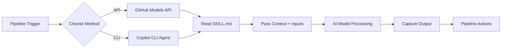

# Pipeline Skill Invoker

## When to invoke

- The user wants to call an AI skill from within a GitHub Actions workflow or Azure DevOps pipeline
- The user needs to automate DevOps tasks using AI in CI/CD
- The user wants to integrate skill-based validation, generation, or analysis into their pipeline gates

## What this skill does

This skill demonstrates how to invoke any DevOps skill from this catalog within a CI/CD pipeline using two approaches:

1. **GitHub Models API** (free tier available, token-based)
2. **GitHub Copilot CLI** (requires Copilot subscription, agent-based)

Both approaches allow you to:
- Pass skill instructions (SKILL.md) as context to an AI model
- Provide dynamic inputs from pipeline variables
- Capture and use AI-generated outputs in subsequent pipeline steps
- Implement AI-powered gates, validators, and generators in your CI/CD

## Architecture



## Method 1: GitHub Models API (Recommended for most cases)

### Advantages
- ✅ Free tier available (rate-limited)
- ✅ Works in any pipeline (GitHub Actions, Azure DevOps, GitLab, etc.)
- ✅ Simple HTTP API calls
- ✅ No additional CLI installation needed

### Prerequisites
- GitHub Personal Access Token with `models:read` scope
- Store token as pipeline secret (`GITHUB_TOKEN` or `GH_MODELS_TOKEN`)

### Example: Validate Azure Pipeline YAML

**GitHub Actions:**
```yaml
name: Validate Pipeline with AI

on: [pull_request]

jobs:
  validate:
    runs-on: ubuntu-latest
    steps:
      - uses: actions/checkout@v4
      
      - name: Invoke ADO Pipeline Validator Skill
        id: validate
        run: |
          # Read the skill instructions
          SKILL_CONTENT=$(cat catalog/ado-pipeline-author/SKILL.md)
          
          # Read the pipeline to validate
          PIPELINE_CONTENT=$(cat azure-pipelines.yml)
          
          # Construct the prompt
          PROMPT="You are an Azure DevOps pipeline expert. ${SKILL_CONTENT}

Task: Review this pipeline and identify issues:

\`\`\`yaml
${PIPELINE_CONTENT}
\`\`\`

Provide a JSON response with:
{
  \"valid\": true/false,
  \"issues\": [\"issue1\", \"issue2\"],
  \"recommendations\": [\"rec1\", \"rec2\"]
}"

          # Call GitHub Models API
          RESPONSE=$(curl -s -X POST \
            https://models.github.com/v1/chat/completions \
            -H "Authorization: Bearer ${{ secrets.GH_MODELS_TOKEN }}" \
            -H "Content-Type: application/json" \
            -d "{
              \"model\": \"gpt-4o\",
              \"messages\": [{
                \"role\": \"system\",
                \"content\": \"You are a DevOps pipeline expert.\"
              }, {
                \"role\": \"user\",
                \"content\": $(echo "$PROMPT" | jq -Rs .)
              }],
              \"temperature\": 0.3
            }")
          
          # Extract response
          RESULT=$(echo "$RESPONSE" | jq -r '.choices[0].message.content')
          echo "$RESULT" | tee validation-result.json
          
          # Check if valid
          VALID=$(echo "$RESULT" | jq -r '.valid')
          if [ "$VALID" != "true" ]; then
            echo "::error::Pipeline validation failed"
            exit 1
          fi

      - name: Comment on PR
        if: always()
        uses: actions/github-script@v7
        with:
          script: |
            const fs = require('fs');
            const result = JSON.parse(fs.readFileSync('validation-result.json', 'utf8'));
            const body = `## 🤖 AI Pipeline Validation
            
**Status:** ${result.valid ? '✅ Valid' : '❌ Issues Found'}

${result.issues?.length ? '### Issues\n' + result.issues.map(i => `- ${i}`).join('\n') : ''}

${result.recommendations?.length ? '### Recommendations\n' + result.recommendations.map(r => `- ${r}`).join('\n') : ''}`;
            
            github.rest.issues.createComment({
              issue_number: context.issue.number,
              owner: context.repo.owner,
              repo: context.repo.repo,
              body
            });
```

**Azure DevOps:**
```yaml
trigger: none

pool:
  vmImage: ubuntu-latest

variables:
  - group: ai-tokens  # Contains GH_MODELS_TOKEN

steps:
- checkout: self

- pwsh: |
    # Read skill content
    $skillContent = Get-Content catalog/ado-pipeline-author/SKILL.md -Raw
    $pipelineContent = Get-Content azure-pipelines.yml -Raw
    
    $prompt = @"
    You are an Azure DevOps pipeline expert. $skillContent
    
    Task: Review this pipeline and identify issues:
    
    ``yaml
    $pipelineContent
    ``
    
    Provide a JSON response with: {"valid": true/false, "issues": [], "recommendations": []}
    "@
    
    $body = @{
        model = "gpt-4o"
        messages = @(
            @{ role = "system"; content = "You are a DevOps pipeline expert." }
            @{ role = "user"; content = $prompt }
        )
        temperature = 0.3
    } | ConvertTo-Json -Depth 10
    
    $headers = @{
        "Authorization" = "Bearer $(GH_MODELS_TOKEN)"
        "Content-Type" = "application/json"
    }
    
    $response = Invoke-RestMethod -Uri "https://models.github.com/v1/chat/completions" `
        -Method Post -Headers $headers -Body $body
    
    $result = $response.choices[0].message.content | ConvertFrom-Json
    $result | ConvertTo-Json | Out-File validation-result.json
    
    if (-not $result.valid) {
        Write-Host "##vso[task.logissue type=error]Pipeline validation failed"
        Write-Host "##vso[task.complete result=Failed]"
        exit 1
    }
    
  displayName: 'Validate Pipeline with AI'

- task: PublishBuildArtifacts@1
  inputs:
    pathToPublish: validation-result.json
    artifactName: validation
```

## Method 2: GitHub Copilot CLI

### Advantages
- ✅ Access to full Copilot capabilities
- ✅ Can use custom agents/plugins
- ✅ Better context awareness

### Prerequisites
- GitHub Copilot subscription (Pro, Business, or Enterprise)
- GitHub CLI (`gh`) installed in pipeline environment
- Copilot CLI installed (`gh extension install github/copilot`)

### Example: Generate Terraform from Bicep

**GitHub Actions:**
```yaml
name: Convert IaC with Copilot

on:
  workflow_dispatch:
    inputs:
      source_file:
        description: 'Bicep file to convert'
        required: true

jobs:
  convert:
    runs-on: ubuntu-latest
    steps:
      - uses: actions/checkout@v4
      
      - name: Setup GitHub CLI
        run: |
          gh extension install github/copilot || true
          gh auth login --with-token <<< "${{ secrets.GITHUB_TOKEN }}"
      
      - name: Convert with Copilot CLI
        run: |
          BICEP_CONTENT=$(cat "${{ github.event.inputs.source_file }}")
          SKILL_CONTENT=$(cat catalog/bicep-module-generator/SKILL.md)
          
          # Use Copilot CLI in non-interactive mode
          RESULT=$(gh copilot suggest -t shell "Convert this Bicep to Terraform:

$SKILL_CONTENT

Bicep file:
\`\`\`bicep
$BICEP_CONTENT
\`\`\`

Output only the Terraform code, no explanations." 2>&1)
          
          echo "$RESULT" > converted.tf
      
      - name: Create PR with converted file
        run: |
          git config user.name "github-actions[bot]"
          git config user.email "github-actions[bot]@users.noreply.github.com"
          git checkout -b "terraform-conversion-$(date +%s)"
          git add converted.tf
          git commit -m "Convert Bicep to Terraform using AI"
          git push origin HEAD
          gh pr create --title "AI-Generated: Terraform from Bicep" \
            --body "Automated conversion using GitHub Copilot CLI"
```

## Reusable Script

For easier integration, use the provided helper scripts:

### PowerShell (Windows/Linux/macOS)
```powershell
.\scripts\invoke-skill.ps1 `
    -SkillPath "catalog/ado-pipeline-author/SKILL.md" `
    -Task "Review this pipeline for security issues" `
    -Input (Get-Content pipeline.yml -Raw) `
    -OutputFile "result.json"
```

### Bash (Linux/macOS)
```bash
./scripts/invoke-skill.sh \
    --skill catalog/gha-workflow-author/SKILL.md \
    --task "Generate a workflow for Node.js CI" \
    --input "Node 20, npm, Jest tests" \
    --output workflow.yml
```

## Available Skills for Pipeline Invocation

| Skill | Use Case | Example Pipeline Task |
|-------|----------|----------------------|
| `ado-pipeline-author` | Validate/generate ADO YAML | Gate PRs that modify pipelines |
| `gha-workflow-author` | Validate/generate GitHub Actions | Auto-generate workflows from templates |
| `bicep-module-generator` | Generate/review Bicep | IaC validation and generation |
| `terraform-module-reviewer` | Review Terraform | Security and best practice checks |
| `dockerfile-hardener` | Harden Dockerfile | Container security gate |
| `devsecops-preflight` | Security scanning | Pre-deployment security checks |
| `helm-chart-scaffold` | Generate Helm charts | Auto-create charts from app specs |
| `k8s-manifest-author` | Generate K8s manifests | Deploy config generation |
| `observability-wiring` | Add monitoring | Auto-instrument apps |

## Best Practices

1. **Cache skill content**: Read SKILL.md once, reuse across steps
2. **Use structured output**: Request JSON for easier parsing
3. **Set appropriate temperature**: 0.1-0.3 for deterministic tasks, 0.7-0.9 for creative tasks
4. **Rate limiting**: GitHub Models free tier has limits (see docs)
5. **Error handling**: Always check API responses and handle failures
6. **Security**: Never log API tokens; use pipeline secrets
7. **Cost**: Copilot CLI requires subscription; Models API has free tier

## Troubleshooting

**"401 Unauthorized"**
- Verify GitHub token has `models:read` scope
- Check token is stored in pipeline secrets correctly

**"Rate limit exceeded"**
- Free tier: 15 req/min (low models), 10 req/min (high models)
- Consider upgrading to paid GitHub Models tier
- Implement retry logic with exponential backoff

**"Empty or invalid response"**
- Check prompt formatting (escape special characters)
- Verify model name is correct (`gpt-4o`, `gpt-4o-mini`, etc.)
- Increase `max_tokens` if response is truncated

**Copilot CLI not available**
- Ensure Copilot subscription is active
- Install with `gh extension install github/copilot`
- Authenticate with `gh auth login`

## Further Reading

- [GitHub Models Documentation](https://docs.github.com/en/github-models)
- [GitHub Copilot CLI](https://docs.github.com/en/copilot/github-copilot-in-the-cli)
- [Azure OpenAI in Pipelines](https://learn.microsoft.com/azure/devops/pipelines/library/service-endpoints)
- [GitHub Actions Secrets](https://docs.github.com/en/actions/security-guides/encrypted-secrets)
